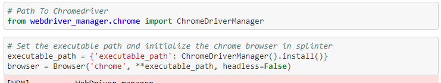
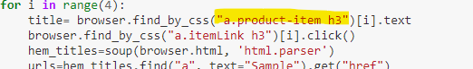
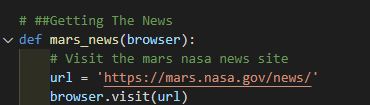
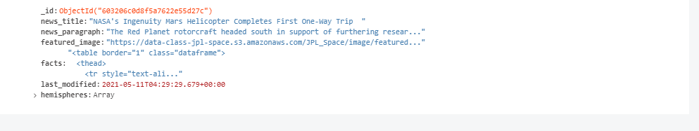

#_What’s the deal with Mars?_|| Data Scrape Analysis

## Overview of Project 
Mars enthusiast client is interested in creating a web application that will, effectively, at the press of a button will gather (and subsequently, stored in a database) information about the planet, Mars. 

Briefly, the former task required devising a script that would scrape data, primarily, articles, titles, facts, and images from various outlets. 

#
## Resources 
* Data Source(s): [Mars’ News Updates]('https://mars.nasa.gov/news/'), [Mars’ Images]('https://data-class-jpl-space.s3.amazonaws.com/JPL_Space/index.html), [Mars’ Facts]( 'http://space-facts.com/mars/'), [Mars’ Hemispheres]( 'https://astrogeology.usgs.gov/search/results?q=hemisphere+enhanced&k1=target&v1=Mars')
* Software/Tool(s): Python | Python Libraries: Beautiful Soup, Splinter, Pandas| Flask| HTML, CSS| VS Code 1.54.3 | MongoDB | Web Driver Manager| Jupyter Notebook**  
 *  Data Access: Workaround, [Project Jupyter: jupyter nbviewer](https://nbviewer.jupyter.org/), a Jupyter Notebook renderer **
     *    Data may not display properly on GitHub, please use provided workaround
#
## Process 
As mentioned, code was drafted to scrape data from various websites specifically to Mars’ while, simultaneously storing data in a centralized location.  

**First** -- > Set-up environment to facilitate the web scrape ( via Jupyter notebook. This included setting an executable path.

 <b><i>Preparing Web Scrape</b></i> 
 

 
 

**Second** --> Identify the appropriate element from each scrape source. Specifically, HTML tags that was associated with the content we needed to access. 

 <b><i>Identifying Tags</b></i> 
 

 
 

**Third** --> Create functions for each instance, i.e., facts, news, etc. 

 <b><i>Example Function</b></i> 
 

 
 

**Fourth** -- > Connect the web application to the Mongo DB.

 <b><i>Mars App, Mongo DB (database)</b></i> 
 

 
 

#

## Next Steps: _Style_
In the next phase of this task, would be to incorporate additional Bootstrap 3 components. 

Ultimately, the aesthetic application should have a clean, visually appealing presence. 

---
#### Author
_Whitney D. Gardner_
